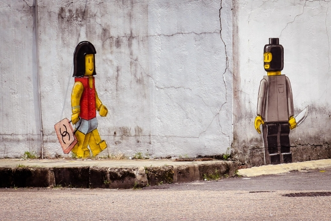

CrimeWatch
==========

Crime reporting and vizualisation project for Malaysia

Overall Goals
=============

 - Crowdsource tracking of crime reports in Malaysia
 - Live visualizations of crime as they are reported
 - Visualizations to show heat maps of different types of crimes by location
 - Robust system that could be used by all, including different systems to aggregate/correlate

Background
==========

Malaysian government has stopped providing crime statistics to the United Nations. They have also refused
to share raw statistics of reported crimes, even in Parliament. [1] The public has no information of crime
hotspots. Official statistics of reduction in crime does not match increasing prevalance of people
affected by crime on a daily basis or police advisories that mark even residential suburbs as dangerous
areas targeted for crime.

Use cases
=========

 - Public - To share crime affecting them, to warn others and to help in sharing information for investigations
 - Public - Would like to know where, crime is happening as it happens.
 - Public - Would like to know what kind of crimes are happening in specific areas.
 - Public - Neighourhood watche would like to know what sort of crimes they have to look out for
 - Police - Detectives would want to search for information and patterns to solve caes
 - Police - Will be able to see heatmaps of problematic areas to assign more resources
 - Police - Will be able to justify lack of resources if crime escalating in an area
 - Local Councils - Would like to see crime hotpots, to see what improvements could be done (eg. better lighting)
 - Journalists - Additional information for stories
 - Researchers - Be able to get access to raw data for detailed analysis

Existing implementations and reports for reference
==================================================

Systems:

So far almost all systems worldwide rely on open data, which is one of
the problems identified here in Malaysia.

 - Crimereports https://www.crimereports.com (propietary, relies on open
   data)
 - Tyler Sirens http://www.joeycoleman.ca/2012/03/14/tyler-sirens-a-real-time-open-source-crime-map-coming-to-hamilton
 - crimespotting http://oakland.crimespotting.org 
   Also uses public data, but the UI has interesting time based info,
   such as light, dark, nightlife, commute and swing shift.

Data:

- FBI Uniform Crime Reports http://www.fbi.gov/about-us/cjis/ucr/ucr
- Street level crime  http://data.gov.uk/dataset/england-national-crime-mapping

Technical Design
================

Milestone 1 - Capture requirements as best as possible

The initial milestone for this project is design a good set of fields an
and forms storing reports that can be used to effectively solve key uses
cases.

Some examples of fields it would have:

 - Fields from Repot Polis (official Police report)
 - Detailed geolocation if possible

Milestone 2 - Initial Test Demo

 - Initial backend system for form storage, API and web based client.
 - Basic visulizations of reports on maps and some example statistics
 - Ease of use should be a focus from early stage
 - TODO

Milestone 3 - Public pilot

 - Web client with mobile support
 - Mobile/Tablet app (Android or IOS depending on dev availability)
 - TODO

Issues
======

 - Privacy TODO
 - Security TODO
 - Moderation - filtering good from wrong/bad reports for an open system
   TODO

[1]: http://www.nytimes.com/2013/10/20/world/asia/soaring-crime-rate-takes-a-growing-malaysia-by-surprise.html
